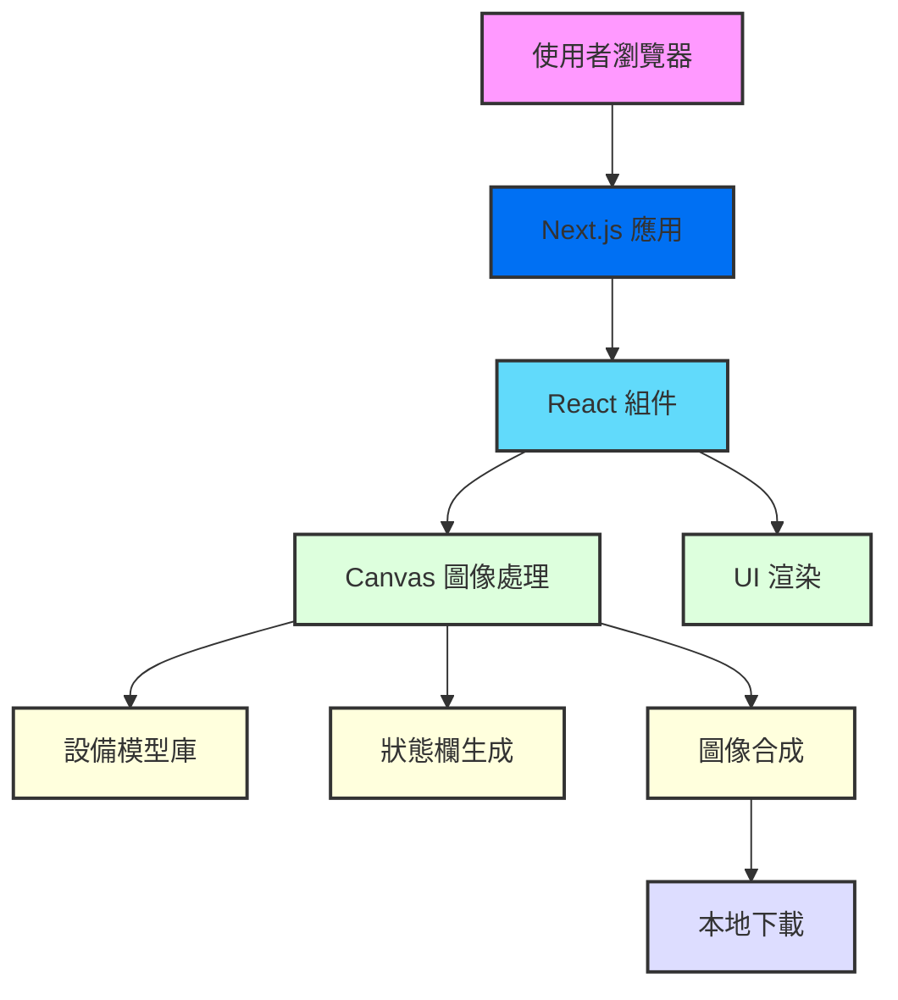

**AppShot 純前端架構圖**

這是一個基於 React 和 Next.js 的純前端架構，所有的處理都在用戶的瀏覽器中完成：

1. 使用者訪問 AppShot 網站
2. Next.js 應用載入 (靜態生成的頁面)
3. React 組件在客戶端渲染
4. 使用者上傳圖片後，通過 Canvas API 進行處理
5. 從內建的設備模型庫讀取模板
6. 生成狀態欄與系統元素
7. 圖像合成將用戶圖片與設備模型結合
8. 最終圖像直接下載到用戶本地，無需經過伺服器

這種架構的優點是：

- 無需後端伺服器
- 使用者隱私得到保護，圖片不離開本地
- Next.js 提供更好的載入性能和 SEO 優化
- 可以輕鬆部署到 Vercel 或其他靜態網站託管服務
- 維護成本極低
